# Konfigurasi Subnetting MikroTik

## Langkah-langkah :

1. Buka terminal pada perangkat Debian dan jalankan perintah `ip addr` untuk menampilkan alamat IP yang sesuai dengan nomor meja komputer yang digunakan.

2. Lakukan reset konfigurasi pada perangkat MikroTik sehingga alamat IP berubah menjadi 192.168.88.102.

3. Sambungkan kabel WLAN pada laptop.

4. Download dan instal Winbox pada laptop. 
    <space> 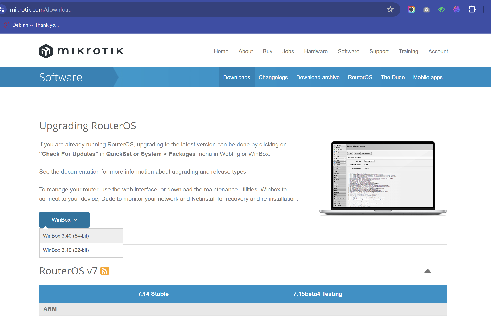

5. Jalankan Winbox pada laptop.

6. Hubungkan ke alamat fisik (MAC) yang tercantum di layar Winbox dengan mengklik MAC address kemudian klik connect. Jika terjadi pesan error, pergi ke tools, pilih legacy mode, dan coba sambungkan kembali. 
    <space> 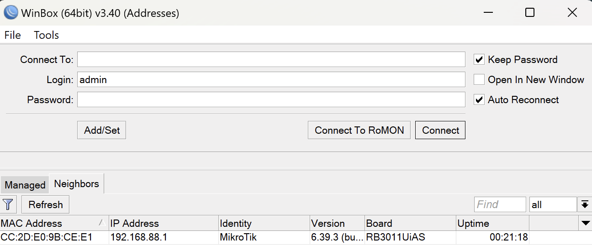

7. Pertama-tama untuk mengecek level mikrotik, cari 'System' di sidebar dan pilih License. Mikrotik yang digunakan memiliki level 5. 
    <space> 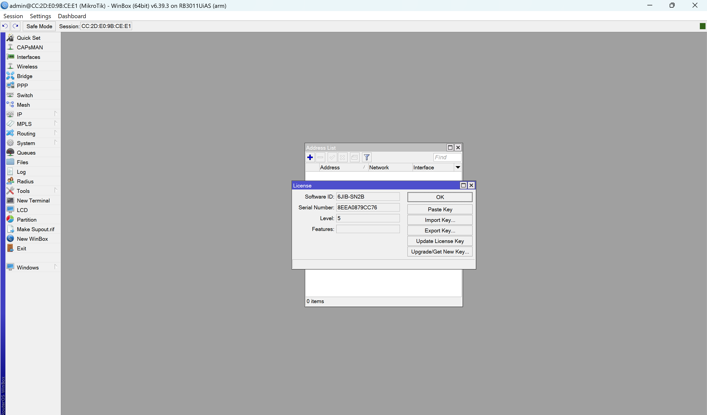

8. Tambahkan alamat IP baru dengan pergi ke 'IP' di sidebar dan memilih 'Address List'. Klik tanda plus berwarna biru di sebelah kiri atas. Masukkan alamat IP 192.168.88.5/24, network 192.168.88.0, dan interface diether1. 
    <space> 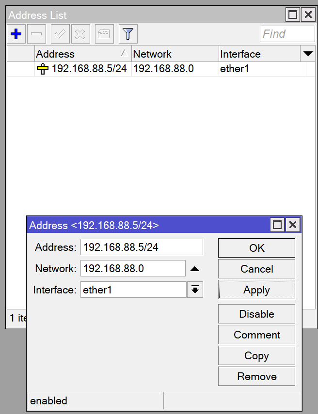

9. Buka terminal baru dan jalankan perintah 'ping 192.168.88.254' untuk memastikan berhasil melakukan ping ke IP tersebut. 
    <space> 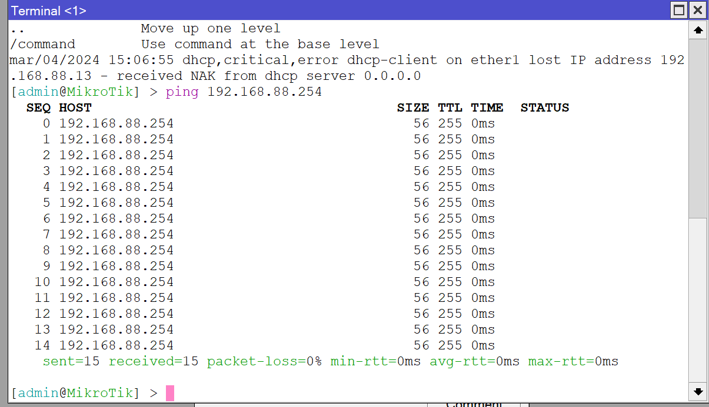

10. Buka 'Bridge' dari sidebar dan klik tanda plus untuk menambahkan bridge baru. Beri nama 'bridge1' dan klik apply. 
    <space> 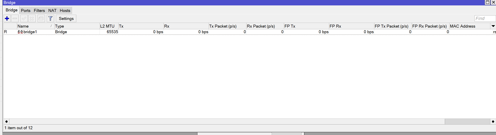

11. Pindah ke tab Ports, klik tanda plus. Pada Bridge Port, atur interface di ether2 dan Bridge di bridge1. Lakukan hal yang sama pada ether3,4,5. 
    <space> 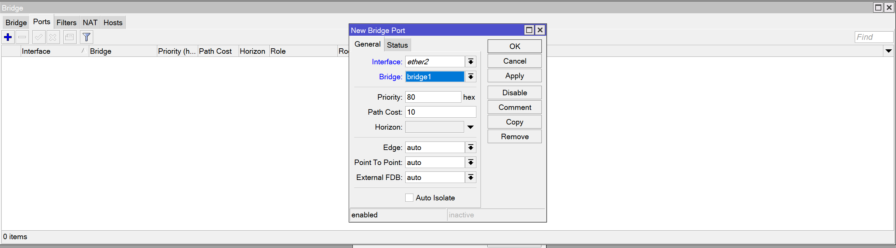
    <space> 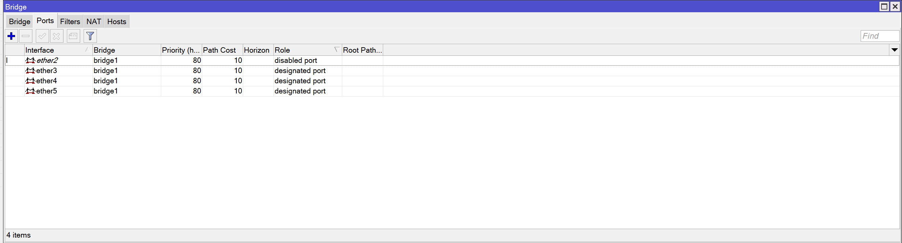

12. Atur gateway dari sidebar 'IP', kemudian pilih route dan klik tanda plus untuk menambahkan route. Masukkan 0.0.0.0 untuk destination address dan 192.168.88.254 untuk gateway. Klik apply untuk menerapkan. 
    <space> 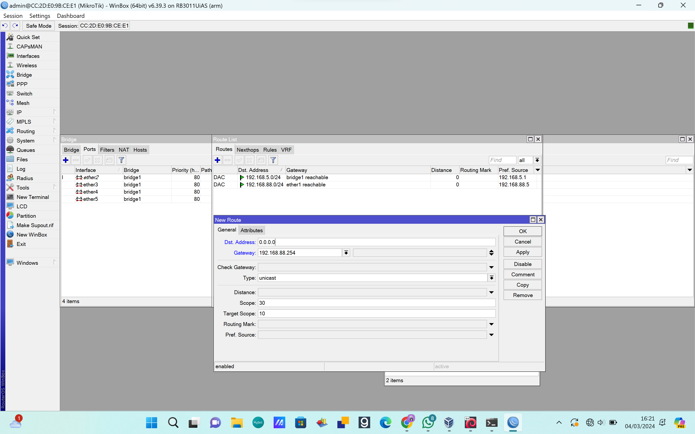

13. Konfigurasi DHCP dari sidebar 'IP', pilih DHCP server. Pada DHCP Setup, pilih bridge1 di DHCP Server Interface, ubah Set Addresses menjadi 192.168.5.200-192.168.5.254. Simpan perubahan yang sudah dilakukan.  
    <space> 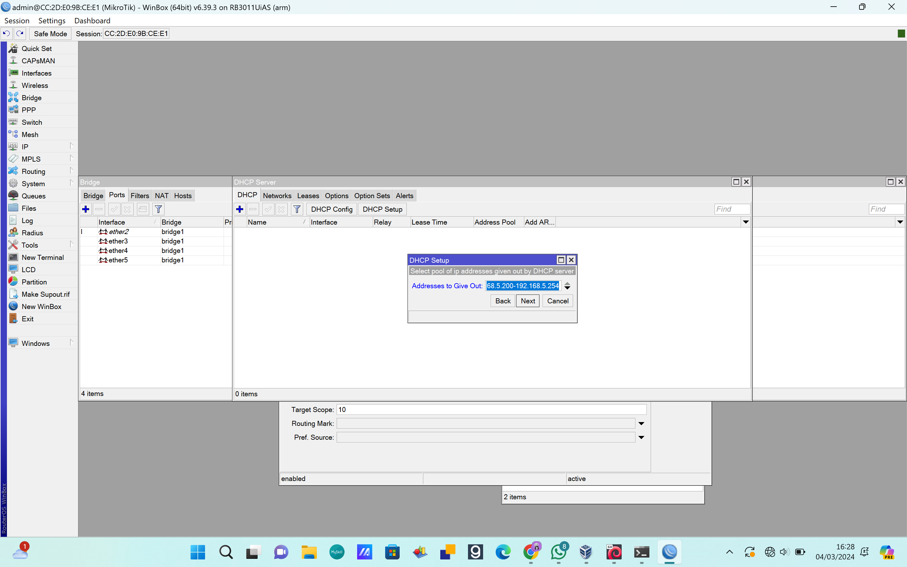

14. Buka 'IP' dan pilih 'DNS'. Tambahkan DNS dengan alamat PENS yaitu 202.9.85.4.

15. Terakhir, atur firewall dari sidebar 'IP'. Pilih NAT dan klik tanda plus. Masukkan source addressnya 192.168.5.0/24 dan destination addressnya 0.0.0.0. Klik apply untuk menyimpan.  
    <space> 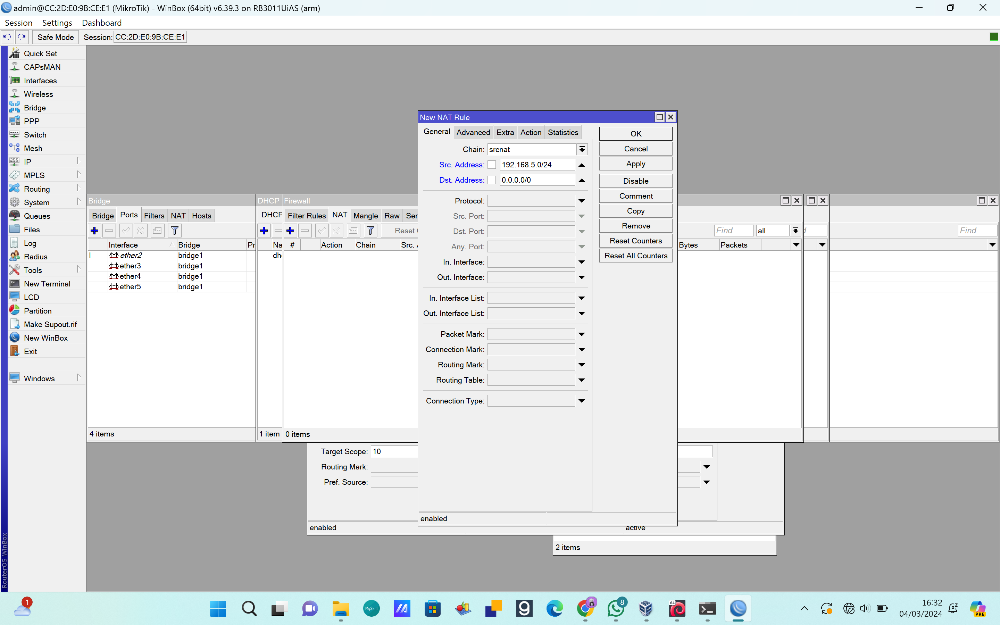

Setelah mengikuti langkah-langkah di atas dengan benar, MikroTik akan terhubung sesuai dengan konfigurasi yang telah ditentukan.