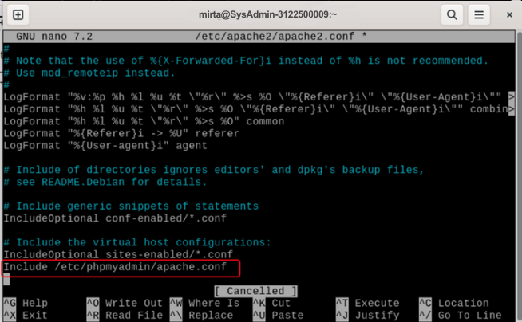
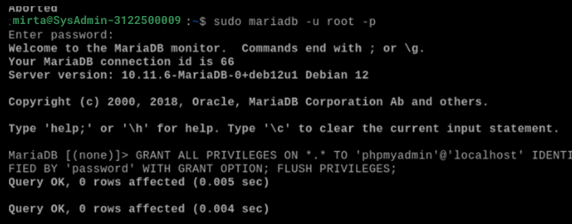
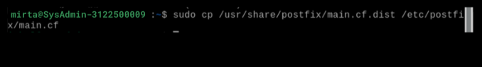
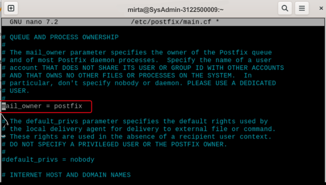
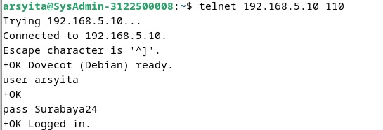

  <h2 style="text-align: center;font-weight: bold">Praktikum 5 Instalasi dan Konfigurasi Web Server, Database Server, dan Mail Server</h2>
  <h4 style="text-align: center;">Dosen Pengampu : Dr. Ferry Astika Saputra, S.T., M.Sc.</h4>

 

  
  <h4 style="text-align: center;">Disusun Oleh :</h4>
  

    <strong>Mirta Chadhirotin Nachlah (3122500009)</strong>
  

<h4 style="text-align: center;line-height: 1.5">Politeknik Elektronika Negeri Surabaya Departemen Teknik Informatika Dan Komputer Program Studi Teknik Informatika 2023/2024</h4>
  

# Daftar Isi

| Nomor | File                                                                        |
| ----- | --------------------------------------------------------------------------- |
| 1     | [Konfigurasi NTP Server](#NTP-Server)                                       |
| 2     | [Konfigurasi Web Server](#Apache-2-dan-PHP-FM)                              |
| 3     | [Konfigurasi Database Server](#MariaDB-&-PhpMyAdmin)                        |
| 4     | [Konfigurasi mail server](#Email-System)                                    |
| 5     | [Final Check All Services](#Final-Check-All-Services)                       |
| 6     | [Test Email With Email Client - Thunderbird](#Thunderbird-Email-GUI-Client) |
| 7     | [Konfigurasi roundcube](#Roundcube-Webmail)                                 |
| 8     | [(Tambahan) Praktikum Mail Server Antar Kelompok](#Melanjutkan-setup-web-email-server) |

---

# NTP Server

1.  Lakukan instalasi paket layanan sinkronisasi waktu → `sudo apt install systemd-timesyncd`
     

2.  Melakukan konfigurasi timezone ke Asia/Jakarta → `sudo timedatectl set-timezone Asia/Jakarta`
     

3.  Melakukan konfigurasi Real Time Clock (RTC) untuk merefer ke UTC (Coordinated Universal Time) → `sudo timedatectl set-local-rtc false`
     

4.  Mengaktifkan NTP Client untuk sinkronisasi waktu → `sudo timedatectl set-ntp true`
     

5.  Menyunting file timesyncd.conf untuk mengarah ke NTP server terdekat untuk mendapatkan waktu delay terpendek. Biasanya setiap organisasi atau negara mempunyai NTP Server sendiri → `sudo nano /etc/systemd/timesyncd.conf`
     

6.  Restart layanan sinkronisasi waktu dan pastikan layanan berjalan dengan benar

        `sudo systemctl restart systemd-timesyncd`

     
Mengecek status layanan sinkronisasi waktu → `sudo systemctl status systemd-timesyncd`
     
Dapat dilihat status active(running)

7.  Lakukan pengecekan kesesuaian tanggal system dengan perintah → `timedatectl`
     
Menampilkan status sinkronisasi waktu pada sistem dengan server NTP (Network Time Protocol) → `sudo timedatectl timesync-status`
  

Bisa dilihat sudah tersambung ke NTP 0.id.pool.ntp.org, dan memiliki delay waktu yang terbilang cukup kecil yaitu +- 30ms

# Apache 2 dan PHP-FM

## Install Apache2

1.  Install Apache2 → `sudo apt -y install apache2`
     

2.  Melakukan konfigurasi Apache2

- `sudo nano /etc/apache2/conf-enabled/security.conf`  
     

  Mengganti line 12 --> `ServerTokens Prod` --> berarti Apache hanya akan menampilkan informasi identifikasi server yang minimal dalam header responsnya.

- `sudo nano /etc/apache2/mods-enabled/dir.conf`
     

  Menambahkan nama file yang hanya bisa diakses dengan nama direktori, yaitu index.html, index.htm, dan index.php

- `sudo nano /etc/apache2/apache2.conf`
     

  Line 70 --> Menambahkan specify server name

- `sudo nano /etc/apache2/sites-enabled/000-default.conf`
     

  Mengganti line 11 --> Mengganti webmaster's email

- `systemctl reload apache2`
     

  Melakukan reload layanan apache

3.  Melakukan test ke web browser
     

## Install PHP 8.2

1.  Melakukan install PHP versi 8.2 beserta modul mbstring dan paket pear --> `sudo apt -y install php8.2 php8.2-mbstring php-pear`
     

2.  Mengecek php version → `php -v`
     
    Karena sudah muncul version dari php, berarti php telah berhasil terinstall

3.  Melakukan test terhadap php

    - `nano php_test.php`
     

      Membuat file php_test.php, yang akan mencetak ouytput dari `php -i` ketika dijalankan

    - Jalankan `php php_test.php | head`
     
        Akan menampilkan output dari `php -i` yaitu menampilkan informasi terkait konfigurasi PHP

4.  Melakukan Install PHP-FM → `sudo apt -y install php-fpm`
     

5.  Mengkonfigurasi PHP-FM pada file konfigurasi Apache - `sudo nano /etc/apache2/sites-available/default-ssl.conf`
     

    Menambahkan diantara tag < VirtualHost> - < /VirtualHost> yaitu mengatur Apache HTTP Server agar dapat meneruskan permintaan PHP ke PHP-FPM (PHP FastCGI Process Manager)

    - `sudo a2enmod proxy_fcgi setenvif`
     
    
      digunakan untuk mengaktifkan modul-modul proxy_fcgi dan setenvif dalam server Apache.

    - `sudo a2enconf php8.2-fpm`
     
      digunakan untuk mengaktifkan modul-modul php8.2-fpm

    - `sudo systemctl restart php8.2-fpm apache2`
     
      Melakukan restart service php8.2-fpm dan apache2

6.  Melakukan test validasi terhadap PHP-FM dengan membuat file info.php di root document → `sudo nano /var/www/html/info.php`
     
    Membuat file info.php yang nanti nya outputnya akan menjalankan command `phpinfo()`

7.  Melakukan test di browser, membuka file info.php di browser
     
    Jika berhasil, maka akan menampilkan semua informasi terkait php.

# MariaDB & PhpMyAdmin

## Install MariaDB

1.  Melakukan install mariadb-server --> `sudo apt -y install mariadb-server`
     
2.  `sudo nano /etc/mysql/mariadb.conf.d/50-server.cnf`
     
    Pada line 95 --> Mengkonfirmasi default charset menggunakan utf8mb4.

3.  `sudo systemctl restart mariadb`
     
    Melakukan restart service mariadb

4.  Inisial Konfigurasi dan testing database MariaDB Server - `sudo mysql_secure_installation`
     
    Melakukan beberapa tindakan keamanan standar dalam instalisasi MariaDB, Ditahap ini akan di beri beberapa pertanyaan keamanan. Seperti set MariaDB root password, remove anonymous users, dll.

    - Connect to MariaDB → `sudo mysql`
     
    - Menampilkan hak akses yang dimiliki oleh user root → `show grants for root@localhost;`
     

    - Menampilkan semua daftar user → `select user,host,password from mysql.user;`
     

    - show database list → `show databases;`
     

    - create test database → `create database test_database;`
     

    - create test table on test database → `create table test_database.test_table (id int, name varchar(50), address varchar(50), primary key (id));`
     

    - insert data to test table → `insert into test_database.test_table(id, name, address) values("001", "Debian", "Hiroshima");`
     

    - show test table → `select * from test_database.test_table;`
     

    - delete test database → `drop database test_database;`
     

## Install PhpMyAdmin

1.  Melakukan install phpmyadmin --> `sudo apt install phpmyadmin`
2.  Pilih Apache2 sebagai web server
     

3.  Pilih **yes** agar konfigurator melakukan langkah-langkah yang diperlukan untuk membuat database dan pengguna khusus untuk phpMyAdmin agar dapat berfungsi dengan baik.
     

4.  Masukkan password phpmyadmin
     
     

5.  Menambahkan konfigurasi phpmyadmin di apache2 → `sudo nano /etc/apache2/apache2.conf`
     
    Mendaftarkan file `/etc/phpmyadmin/apache.conf`

6.  Coba membuka phpmyadmin di web browser    
     
     

7.  Menambahkan privillege ke user phpmyadmin - Login ke mariadb → `sudo mariadb -u root -p` - Lalu berikan hak akses penuh kepada user phpmyadmin → `GRANT ALL PRIVILEGES ON *.* TO 'phpmyadmin'@'localhost' IDENTIFIED BY 'password' WITH GRANT OPTION; FLUSH PRIVILEGES;`
     
     

    Bisa dilihat sekarang user phpmyadmin, memiliki hak akses penuh seperti create database, dll.

# Email System

## POSTFIX : SMTP Server (TCP 25)

1.  Melakukan install postfix sasl2-bin --> `sudo apt -y install postfix sasl2-bin`
2.  Pilih no configuration, karena kita akan melakukan konfigurasi secara manual
     

3.  Mencopy file /usr/share/postfix/main.cf.dist ke /etc/postfix/main.cf --> `sudo cp /usr/share/postfix/main.cf.dist /etc/postfix/main.cf`
     

4.  `sudo nano /etc/postfix/main.cf` - Uncoment line 82
     
    - Uncoment line 98 dan isi dengan email hostname kelompok5
     

    - Uncoment line 106 dan isi dengan hostname kelompok5
     

    - Uncoment line 127
     

    - Uncoment line 141
     

    - Uncoment line 189
     

    - Uncoment line 232
     

    - Uncoment line 277
     

    - Uncoment line 294 dan tambahkan local network
     

    - Uncoment line 416
     

    - Uncoment line 427
     

    - Uncoment line 449
     

    - Comment line 558 dan tambahkan di line 589 konfigurais smtpd_banner
     

    - Tambahkan di line 659 sendmail_path
     

    - Tambahkan di line 664 newaliases_path
     

    - Tambahkan di line 669 mailq_path
     

    - Tambahkan di line 675 setgid_group
     

    - Comment line 679    
     

    - Comment line 683
     

    - Comment line 688
     

    - Comment line 692
     

    - Tambahkan internet protocol di line 692
     

    - Menambahkan config di line terakhir. Yaitu mematikan SMTP VRFY command, require HELO command to sender hosts, Mengatur limit an email size, dan mengatur SMTP-Auth settings
     

5.  Meng-update database alias untuk sistem postfix --> `sudo newaliases`
     

6.  Melakukan restart layanan postfix --> `systemctl restart postfix`
     

7.  Menambahkan konfigurasi anti spam

    - `sudo nano /etc/postfix/main.cf`
     

    - Melakukan restart layanan postfix --> `sudo systemctl restart postfix`
     

## Install **DOVECOT : IMAP4 (TCP 143) and POP3 (TCP110)**

1.  Melakukan install dovecot-core, dovecot-pop3d, dovecot-imapd --> `sudo apt -y install dovecot-core dovecot-pop3d dovecot-imapd`
     

2.  `sudo nano /etc/dovecot/dovecot.conf`
     
    Uncoment line 30 agar Dovecot mendengarkan koneksi pada semua antarmuka jaringan yang tersedia.

3.  `sudo nano /etc/dovecot/conf.d/10-auth.conf`
     

    Uncoment line 10 dan izinkan plain text auth - Tambahkan auth_mechanisms di line 100
     

4.  `sudo nano /etc/dovecot/conf.d/10-mail.conf`
     
    Ubah mail location di line30 menjadi Maildir

5.  `sudo nano /etc/dovecot/conf.d/10-master.conf`
     
    Tambahkan Postfix smtp-auth di line 107 - 109

6.  Restart layanan dovecot --> `sudo systemctl restart dovecot`
     

# Final Check All Services

1.  `netstat -a| grep LISTEN`
     
    Akan terlihat hasilnya dengan status Server (LISTEN) : MariaDB(MySQL), IMAP, POP3, DNS(domain - http), IMAPS, POP3S, SSH, Postfix (SMTP)

2.  Melakukan Cek terhadap Layanan Posfix `telnet mail.kelompok5.local 25`
     
    Memeriksa apakah server mail.kelompok5.local dapat menerima koneksi pada port 25. Lalu menjalankan command `ehlo mail.kelompok5.local` yang digunakan untuk memberikan informasi tentang kemampuan server, seperti fitur-fitur yang didukung atau batasan konfigurasi.

# Thunderbird Email GUI Client

1.  Melakukan install Thunderbird melalui flatpak --> `flatpak install flathub org.mozilla.Thunderbird`
     

2.  Menginstall thunderbird GUI dari https://flathub.org/apps/org.mozilla.Thunderbird
     

3.  Menambahkan 2 akun email ( yaitu user mirta dan root )
     

4.  Mencoba saling send email - User root mencoba send email ke user mirta
     

    - User mirta mengek email yang diterima
     

**Additional :** Untuk melakukan penambahan akun email anda dapat melalui terminal dengan command yang sama saat melakukan penambahan user. `sudo adduser <namauser>`. Nantinya anda akan disuruh mengisi informasi terkait user tersebut.

# Roundcube Webmail

1.  Membuat database yang nantinya digunakan untuk roundcube
     

2.  Melakukan Install dan konfigurasi RoundCube - Melakukan install roundcube -->`sudo apt -y install roundcube roundcube-mysql`
    pilih no karena akan melakukan konfigurasi secara manual
     
     

3.  Masuk ke directory roundcube --> `cd /usr/share/dbconfig-common/data/roundcube/install`
     

4.  Mengimpor file mysql ke dalam database roundcube dengan menggunakan akun pengguna (-u roundcube) dan database (-D roundcube) yang sesuai. --> `sudo mysql -u roundcube -D roundcube -p < mysql`
    dan masukkan password mariaDB user roundcube (password)  
     

5.  Melakukan set database informasi --> `sudo nano /etc/roundcube/debian-db.php`
     

6.  `sudo nano /etc/roundcube/config.inc.php`
     
    Melakukan konfigurasi imap_host, smtp_host, smtp user dan password

7.  `sudo nano /etc/apache2/conf-enabled/roundcube.conf`
     
    Mengatur agar ketika membuka path /roundcube di domain kita, akan di arahkan ke dirctory /var/lib/roundcube.

8.  Melakukan restart service apache2 --> `sudo systemctl restart apache2`
9.  Mencoba membuka roundcube di web browser (domain/roundcube)
     

10. Mencoba send email
    User 1 mengirim email ke user mirta
     
    
    Pesan berhasil terkirim :
     

    User mirta mengecek email yang diterima :
     

# Melanjutkan setup web email server
1. Mengubah network NAT menjadi Bridged Adapter dengan name Realtek USB FE Family Controller
   
   
2. Mengubah IP menjadi 192.168.5.10 
   
   

3. Mengubah file nano named.conf.options
   
   

4. Mengubah file /etc/resolv.conf  
    

5. Melakukan pengecekkan dengan nslookup  
    

6. Melakukan setting WinBox
   
   
7. Melakukan Testing atau uji coba
   - Melakukan pengepingan pada detik.com
   
   - Melakukan pengepingan pada ip kelompok6
   

8. Melakukan pengiriman pesan antar kelompok dengan RoundCube
   - Melakukan pengiriman pesan dari arsyita@mail.kelompok5.local ke iqbal@mail.kelompok6.local
    
   - Melakukan penerimaan pesan dari adam@mail.kelompok8.local ke arsyita@mail.kelompok5.local
    

## Melanjutkan Tugas 5 (SMTP, POP3, dan MIME)
### SMTP

> Pengiriman email dari client (device lainnya)

Simple Mail Transfer Protocol (SMTP) adalah sebuah protokol standar untuk mengirim email di internet. SMTP biasa bekerja ketika mengirim email dari email client ke email server lain atau dari satu email server ke email server lainnya. 
Dari praktek di atas, kami menghubungkan ke IP 192.168.5.10 melalui protokol telnet dengan port 25. Port 25 merupakan port non-enkripsi default SMTP. Dengan perintah tersebut, kami menghubungkan ke server email yang mungkin berjalan di alamat IP tersebut.

- `ehlo mail.kelompok5.local` untuk mengkoneksikan ke server email dibuat.
- `mail from` untuk menentukan alamat email pengirim.
- `rcpt to` untuk menentukan alamat email penerima.

### POP3

Post Office Protocol version 3 atau POP3 adalah sebuah protokol email standard yang digunakan untuk menerima email dari sebuah server email ke email client yang digunakan. Dengan POP3, kita dapat mendownload pesan-pesan yang ada pada server email ke komputer atau device dan bisa membacanya bahkan ketika komputer offline atau tidak terkoneksi dengan internet. Jika menggunakan POP3 untuk berhubungan dengan akun email, email-email kita akan didownload ke device lokal dan dihapus dari server email kita. Jadi, jika ingin bisa mengakses email dari beberapa aplikasi yang berbeda, POP3 bukanlah pilihan yang tepat. 
Dari praktek di atas, kami menghubungkan ke IP 192.168.5.10 melalui protokol telnet dengan port 110. Port 110 merupakan port non-enkripsi default POP3. 

- `user arsyita` untuk melakukan login/masuk sebagai arsyita.
- `pass Surabaya24` untuk memasukkan password.
- `list` untuk melihat jumlah daftar pesan email yang diterima.
- `retr 33` untuk melihat dan membuka pesan email dari salah satu email yang diterima sesuai dengan nomor urutannya.

### MIME

#### Analisa header MIME
- Return-Path digunakan untuk menentukan alamat email yang akan menerima laporan undelivered dari sistem email.
- X-Original-To untuk memberikan informasi tentang alamat tujuan asli dari pesan tersebut sebelum proses pengiriman lanjutan.
- Delivered-To untuk menunjukkan alamat email tujuan di level pengiriman yang paling terakhir.
Received untuk mencatat informasi seperti waktu, alamat IP, dan nama host server yang memproses pesan tersebut.
- MIME-Version untuk melihat versi MIME yang digunakan dalam pesan mail ini
- Date untuk memberikan informasi tanggal dan waktu pesan dikirm
- From berisi alamat mail pengirim pesan
- To berisi alamat mail penerima pesan
- Subject merupakan subject atau topik dari suatu pesan
- User-Agent untuk memberikan informasi tentang klien email atau perangkat lunak yang digunakan oleh pengirim kepada penerima.
- Message-ID seperti nomor id (identitas) dari pesan, dan biasanya unik.
- X-Sender untuk memberikan informasi tambahan tentang identitas pengirim pesan kepada penerima.
- Content-Type berisi tipe konten yang terdapat dalam pesan tersebut.

Fungsi dari Content-Type adalah:
1. Menentukan Jenis Konten: menyatakan jenis konten yang terdapat dalam bagian pesan tertentu, seperti teks biasa, HTML, gambar, lampiran, audio, atau video. Sehingga, klien email mengetahui cara menangani dan menampilkan konten pesan dengan benar.
2. Menentukan Pengaturan Karakter: seperti UTF-8 atau ISO-8859-1. Ini penting untuk memastikan bahwa karakter dalam pesan ditampilkan dengan benar, terutama jika pesan mengandung teks dalam bahasa dengan karakteristik khusus.
3. Mendukung Lampiran: Jika pesan mengandung lampiran, "Content-Type" memberikan informasi tentang jenis konten lampiran tersebut (misalnya, PDF, gambar JPEG, dokumen Word, dll.).
4. Mendukung Format Konten: Misalnya, jika pesan mengandung bagian teks biasa dan bagian HTML, "Content-Type" akan menentukan tipe konten untuk masing-masing bagian, tergantung pada preferensi pengguna atau kemampuan klien.

#### Penjelasan MIME

Multipurpose Internet Mail Extensions atau MIME Type adalah standar internet yang menjelaskan konten file internet berdasarkan sifat dan format dokumen, file, atau kumpulan byte yang membantu browser membuka file dengan ekstensi atau plugin yang sesuai. Ini didefinisikan dan distandarisasi dalam IETF's RFC 6838.

Tipe MIME berisi dua bagian, yaitu.
1. Type, menjelaskan kategorisasi tipe MIME yang ditautkan satu sama lain.
Subtype, unik untuk tipe file tertentu yang merupakan bagian dari tipe.
2. Browser menggunakan jenis MIME, bukan ekstensi file, untuk menentukan cara memproses URL, sehingga web server harus mengirimkan jenis MIME yang benar di header jenis konten respons. Jika ini tidak dikonfigurasi dengan benar, browser mungkin salah menafsirkan konten file dan situs tidak akan bekerja dengan benar, dan file yang diunduh mungkin salah dalam penanganan.

#### Jenis-Jenis MIME Type
Ada dua kelas tipe: discrete dan multipart. Jenis diskrit adalah jenis yang mewakili satu file atau media, seperti satu teks atau file musik, atau video. Jenis multipart adalah salah satu yang mewakili dokumen yang terdiri dari beberapa bagian komponen, yang masing-masing mungkin memiliki jenis MIME tersendiri; atau, tipe multipart dapat merangkum banyak file yang dikirim bersama dalam satu transaksi. Misalnya, tipe MIME multipart digunakan saat melampirkan banyak file ke email.

Dengan pengecualian multipart/form-data, digunakan dalam metode POST pada HTML Forms, dan multipart/byteranges, digunakan dengan 206 Partial Content untuk mengirim bagian dari dokumen, HTTP tidak menangani dokumen multipart dengan cara khusus: pesan ditransmisikan ke browser.