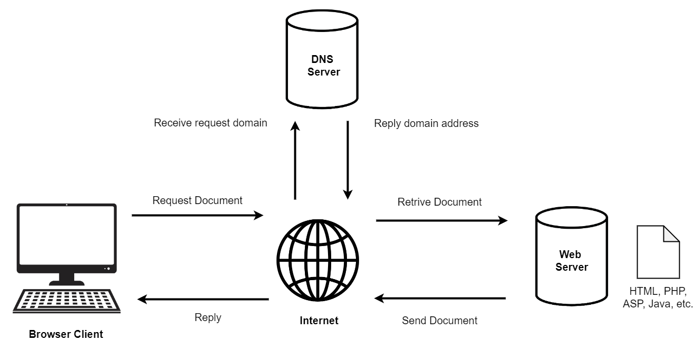
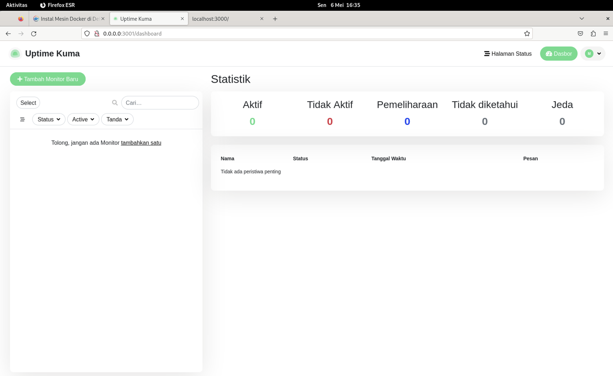

<h1 align="Center">LAPORAN WORKSHOP ADMINISTRASI JARINGAN</h1>

  

<h4 align="Center">Disusun oleh:</h4>

<h4 align="center">
Nama : Mirta Chadhirotin Nachlah  
NRP : 3122500009  
Kelas: 2 D3 IT A  
</h4>

<h4 align="center">
Dosen Pengampu : Dr Ferry Astika Saputra ST, M.Sc	
</h4>

 
<h4 align="center">
PROGRAM STUDI TEKNIK INFORMATIKA  
DEPARTEMEN TEKNIK INFORMATIKA DAN KOMPUTER 
POLITEKNIK ELEKTRONIKA NEGERI SURABAYA   
2024
</h4>   

# Daftar Isi

| Nomor | File                                                                        |
| ----- | --------------------------------------------------------------------------- |
| 1     | [Web Server & Web Client](#Web-Server-&-Web-Client)                                       |
| 2     | [Cara Kerja Web Server](#Cara-Kerja-Web-Server)                              |
| 3     | [Cara kerja Web Client](#Cara-kerja-Web-Client)                        |
| 4     | [Install Docker](#Install-Docker)                                    |
| 5     | [Menjalankan project docker example dari github](#Menjalankan-project-docker-example-dari-github)                       |
| 6     | [Tugas Run Uptime Kuma](#Tugas-Run-Uptime-Kuma) |
---

# Web Server & Web Client 
- Fungsi Client :
Client Fungsi utama Client adalah menghasilkan permintaan untuk berbagai layanan yang bersumber dari server. Client juga dapat dinonaktifkan sewaktu-waktu. Contoh klien adalah smartphone, desktop, laptop, dan lainnya.
- Fungsi Web Server :
    - Mentransfer data yang diminta user
Biasanya, sebuah laman web terdiri dari berbagai macam informasi dalam berbagai bentuk, seperti teks, video, gambar, audio, atau dokumen. Berkas-berkas inilah yang nantinya akan dikirimkan ke browser-mu sesuai permintaan. Pada praktiknya langsung, web server akan merespon permintaan yang kamu tulis di address bar dan informasi yang kamu minta tadi akan ditampilkan ke browser-mu. Jika permintaanmu tidak bisa dicari, maka web server akan melakukan pengiriman balik berupa penolakan dengan cara memberikan informasi yang biasa dikenal dengan kode ‘404’, artinya kata kunci yang kamu cari tidak bisa ditemukan.
    - Memeriksa keamanan dari permintaan HTTP
Selain itu, web server berfungsi untuk memeriksa sistem keamanan dari request HTTP
yang diminta oleh klien atau web browser. Web server menggunakan HTTP/HTTPS
sebagai perantara untuk menghubungkan website dengan web server. Proses transfer
data yang dilakukan bersifat privat dan tidak bisa diakses sembarangan oleh publik.

# Cara Kerja Web Server

     

1. Client melakukan permintaan untuk mengakses sebuah domain Uniform Resource Locator (URL) yang diketikkan pada address bar di sebuah browser
2. Permintaan tersebut dikirim ke server penyedia DNS.
3. Bila halaman web tersebut menggunakan database programming, maka akan dihubungkan dengan database server
4. Apabila domain pada URL tersebut ada di web server, maka web server akan segera melakukan respon, dengan menampilkan web yang diinginkan.
5. Apabila domain pada URL tersebut tidak ada, maka akan muncul informasi "Page Not Found" artinya halaman tidak ditemukan.
6. Pengiriman permintaan web dari client tersebut akan didelegasikan melalui DNS server.
7. Demikian seterusnya, karena setiap perangkat terhubung ke internet dan memiliki spesifikasi yang baik, juga dengan koneksi internet yang cukup, maka proses permintaan web tidak akan berlangsung lama.

# Cara kerja Web Client

     

1. Client dapat membangun sebuah halaman web berdasarkan database yang dimiliki, dengan menggunakan perangkat keras (hardware) dan software. Sehingga, menghasilkan tampilan atau UI tertentu. 
2. Server dapat mempengaruhi UI. Server web menerima permintaan dan menyimpan UI web tersebut berupa dokumen HTML. 
3. Client yang meminta akses informasi, dalam hal ini adalah pengguna, maka server akan mengirimkan dokumen HTML tersebut. Hasilnya informasi tampil di browser dan kamu dapat membacanya dengan tampilan UI yang menarik dan mudah dimengerti. 
4. Ketika client (pengguna) sudah mendapatkan informasinya, maka client akan memeriksa kode program atau sintaks. Proses ini menghasilkan database yang diperlukan. Proses ini menggunakan bahasa pemrograman SQL atau sejenisnya. 
5. Proses tersebut diteruskan ke server, sambil menunggu server mendapat respons dari pengguna akhir. Ketika pengguna merespons, permintaan database dibuat untuk client dan hasilnya tayang di layar kamu. 

# Install Docker

1. <h4>Before Install Docker Engine, Uninstall Conflicted</h4>
- `for pkg in docker.io docker-doc docker-compose podman-docker containerd runc; do sudo apt-get remove $pkg; done`  

2. <h4>Install Docker Engine</h4>

- Add Docker's official GPG key: 
- `sudo apt-get update` 

- `sudo apt-get install ca-certificates curl` 

- `sudo install -m 0755 -d /etc/apt/keyrings`

- `sudo curl -fsSL https://download.docker.com/linux/debian/gpg -o /etc/apt/keyrings/docker.asc`
- `sudo chmod a+r /etc/apt/keyrings/docker.asc`
- Add the repository to Apt sources => `echo \`
`"deb [arch=$(dpkg --print-architecture) signed-by=/etc/apt/keyrings/docker.asc] https://download.docker.com/linux/debian \` ` $(. /etc/os-release && echo "$VERSION_CODENAME") stable" | \`
`sudo tee /etc/apt/sources.list.d/docker.list > /dev/null`

- `sudo apt-get update`  

3. <h4>Install Docker Packages</h4>
- `sudo apt-get install docker-ce docker-ce-cli containerd.io docker-buildx-plugin docker-compose-plugin`

4. <h4>Start Docker Engine</h4>
- `sudo service docker start`  

5. <h4>Run a Container</h4>
- Command : docker run [image-name]
`sudo docker run hello-world`  

# Menjalankan project docker example dari github

1. Clone dari github
`git clone https://github.com/alfiyansys/docker-examples.git`  

2. Build ke dalam docker images
`docker build -t example`  

3. Menjalankan docker images
`docker run -p 3000:80 example`  

4. Buka port berikut pada browser
http://localhost:3000  

# Tugas Run Uptime Kuma

1. Run Uptime-Kuma monitoring service using docker: https://github.com/louislam/uptime-kuma
    - `docker run -d --restart=always -p 3001:3001 -v uptime-kuma:/app/data --name uptime-kuma louislam/uptime-kuma:1`  
    

    - Pengecekan pada port 3000
    `http://localhost:3000`  
    
    

2. Run using virtualhost with access domain, example: http://monitoring.kelompokX.local 

- Konfigurasi file db.kelompok5.local
-  > Menambahkan monitoring pada CNAME ns
`sudo nano /var/lib/bind/db.kelompok5.local`  
  
`sudo systemctl restart named`

- Install a2enmod
`sudo a2enmod`  

- Memasukkan package proxy  
`proxy proxy_ajp proxy_http rewrite deflate headers proxy_balancer proxy_connect proxy_html` 

- Konfigurasi Apache2
`sudo nano /etc/apache2/sites-enabled/000-default.conf`  

- Menambahkan beberapa baris untuk monitoring subdomain dengan proxy  
`sudo systemctl restart apache2`  

- Cek dengan browser  

