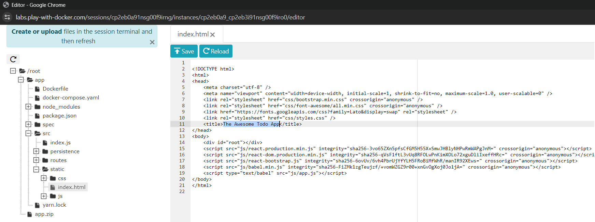

<div align="center">
  <h2 style="text-align: center;font-weight: bold">Praktikum 7<br>Docker 101</h2>
  <h4 style="text-align: center;">Dosen Pengampu : Dr. Ferry Astika Saputra, S.T., M.Sc.</h4>
</div>
<br />
<div align="center">
  
  <h4 style="text-align: center;">Disusun Oleh :</h4>
  <p style="text-align: center;">
    <strong>Mirta Chadhirotin Nachlah (3122500009)</strong>
  </p>
<h4 style="text-align: center;line-height: 1.5">Politeknik Elektronika Negeri Surabaya<br>Departemen Teknik Informatika Dan Komputer<br>Program Studi Teknik Informatika<br>2023/2024</h4>
  <hr>
</div>

# Daftar Isi

| Nomor | File                                                                        |
| ----- | --------------------------------------------------------------------------- |
| 1     | [Getting Started](#Getting-Started)                                       |
| 2     | [Our Application](#Our-Application)                              |
| 3     | [Updating Our App](#Updating-Our-App)                        |
| 4     | [Sharing Our App](#Sharing-Our-App)                                    |
| 5     | [Presisting Our DB](#Presisting-Our-DB)                       |
| 6     | [Using Bind Mounts](#Using-Bind-Mounts) |
| 7     | [Using Docker Compose](#Using-Docker-Compose)                                 |
| 8     | [Image Building Best Practices](#Image-Building-Best-Practices) |

---

# Getting Started

Disini kita akan mencoba melakukan running images docker bernama `dockersamples/101-tutorial`, dikarenakan tidak terdapat pada local machine kita maka docker melakukan pull ke https://hub.docker.com untuk mencari images dengan nama tersebut

    docker run -d -p 80:80 dockersamples/101-tutorial


`docker run` berfungsi menjalankan images dengan param nama pada akhir <docker/docker/getting-started:pwd> pwd adalah tags <br>
`-d` digunakan untuk mode dettach atau dijalankan di background <br>
`-p` set port specified untuk di forward disini 80:80


# Our Application

### Memasukkan Aplikasi ke PWD
Sebelum kita dapat menjalankan aplikasi, kita perlu memasukkan kode sumber aplikasi ke dalam lingkungan Play with Docker. Untuk proyek nyata, Anda dapat mengkloning repo. Namun, dalam kasus ini, Anda akan mengunggah arsip ZIP.

Unduh file zip dan unggah ke Play with Docker. Sebagai tip, Anda dapat ***drag and drop*** file zip (atau file lain) ke terminal di PWD.
<br>

1. **Di terminal PWD, ekstrak file zip dengan perintah berikut:**
   ```
   unzip app.zip
   ```
   <br>

2. **Ubah direktori kerja Anda ke folder 'app' yang baru. Di direktori ini, Anda akan melihat aplikasi sederhana berbasis Node:**
   ```
   cd app/
   ls
   ```
   <br>

### Membangun Container Image Aplikasi
Untuk membangun aplikasi, kita perlu menggunakan Dockerfile. Dockerfile adalah skrip berbasis teks yang digunakan untuk membuat container image. Jika Anda pernah membuat Dockerfile sebelumnya, Anda mungkin melihat beberapa kekurangan pada Dockerfile di bawah ini. Tapi, jangan khawatir! Kita akan membahasnya.

1. **Buat file dengan perintah `vi` bernama `Dockerfile` dengan isi berikut:**
   ```
   FROM node:10-alpine
   WORKDIR /app
   COPY . .
   RUN yarn install --production
   CMD ["node", "/app/src/index.js"]
   ```
   <br>
      <br>

2. **Bangun container image menggunakan perintah docker build:**
   ```
   docker build -t docker-101 .
   ```
   Perintah ini menggunakan Dockerfile untuk membangun container image baru. Anda mungkin melihat banyak "layer" yang diunduh. Ini karena kami memberi instruksi kepada builder untuk memulai dari image node:10-alpine. Namun, karena kami tidak memiliki image tersebut di mesin kami, image itu perlu diunduh.

   <br>
   
   Setelah itu, kami menyalin aplikasi kami dan menggunakan yarn untuk menginstal dependensi aplikasi kami. Perintah CMD menentukan perintah default yang dijalankan saat memulai container dari image ini.

### Menjalankan Container Aplikasi
Sekarang setelah kita memiliki image, mari kita jalankan aplikasinya! Untuk melakukannya, kita akan menggunakan perintah `docker run` (ingat perintah ini dari sebelumnya?).

1. **Mulai container Anda menggunakan perintah `docker run`:**
   ```
   docker run -dp 3000:3000 docker-101
   ```
   Ingat flag -d dan -p? Kami menjalankan container baru dalam mode "detached" (di latar belakang) dan membuat pemetaan antara port 3000 host dengan port 3000 di container.

   <br>
   
2. **Buka aplikasi dengan mengklik badge "3000" di bagian atas antarmuka PWD. Setelah terbuka, Anda akan melihat daftar tugas kosong!**
   
   <br>
   <br>
   
3. **Cobalah tambahkan satu atau dua item dan lihat apakah berfungsi sesuai harapan. Anda dapat menandai item sebagai selesai dan menghapus item.**
    <br>

Pada titik ini, Anda seharusnya memiliki manajer daftar tugas yang berjalan dengan beberapa item, semuanya dibangun oleh Anda! Sekarang, mari kita lakukan beberapa perubahan dan belajar tentang mengelola container kita.

### Analisis
Dalam bagian singkat ini, kita belajar dasar-dasar tentang membangun container image dan membuat Dockerfile untuk melakukannya. Setelah kita membangun image, kita memulai container dan melihat aplikasi yang berjalan!

Selanjutnya, kita akan membuat modifikasi pada aplikasi kita dan belajar cara memperbarui aplikasi yang berjalan dengan image baru. Sepanjang jalan, kita akan mempelajari beberapa perintah berguna lainnya.

# Updating Our App
### Memperbarui Kode Sumber Kita
1.       
   
   <br>

2. **Mari kita bangun versi image yang diperbarui, menggunakan perintah yang sama seperti sebelumnya.**
   ```
   docker build -t docker-101 .
   ```
   <br>

3. **Mari kita mulai container baru menggunakan kode yang diperbarui.**
   ```
   docker run -dp 3000:3000 docker-101
   ```
   <br>

   Ups! Anda mungkin melihat kesalahan seperti ini (ID akan berbeda):
   Jadi, apa yang terjadi? Kita tidak bisa memulai container baru karena container lama kita masih berjalan. Masalah ini terjadi karena container tersebut menggunakan port 3000 dari host dan hanya satu proses (termasuk container) yang bisa mendengarkan port tertentu. Untuk memperbaikinya, kita perlu menghapus container lama.

### Mengganti Container Lama Kita
Untuk menghapus container, pertama-tama harus dihentikan. Kemudian, bisa dihapus.

1. **Dapatkan `ID container` dengan menggunakan perintah `docker ps`. Lalu Gunakan perintah `docker stop` untuk menghentikan container.**
   
   
   
2. **Setelah container berhenti, Anda bisa menghapusnya dengan menggunakan perintah `docker rm <container-id>`.**

3. **Sekarang, jalankan aplikasi yang telah diperbarui.**
   
   <br>

```
   Tips profesional
   Anda bisa menghentikan dan menghapus container dalam satu perintah dengan menambahkan `flag` "force" ke perintah `docker rm`. Misalnya:
   ```

### Analisis
Meskipun kita berhasil membangun pembaruan, ada dua hal yang mungkin Anda perhatikan:

Semua item yang ada di daftar tugas kita hilang! Itu bukan aplikasi yang bagus! Kita akan membahasnya sebentar lagi.
Ada banyak langkah yang terlibat untuk perubahan kecil. Pada bagian berikutnya, kita akan membahas bagaimana melihat pembaruan kode tanpa perlu membangun dan memulai container baru setiap kali kita membuat perubahan.

# Sharing Our App
### Membuat Repositori Baru
Untuk mendorong (push) sebuah image, kita pertama-tama perlu membuat repo di Docker Hub.

1. **Buka Docker Hub dan login jika diperlukan. Klik tombol `Create a Repository`. Untuk nama repo, gunakan `101-todo-app`. Pastikan Visibilitasnya adalah Public. Klik tombol `Create`!**
   <br>

2. **Jika Anda melihat di sisi kanan halaman, Anda akan menemukan bagian bernama Docker commands. Ini memberikan contoh perintah yang perlu Anda jalankan untuk mendorong image ke repo ini.**
   <br>>

### Mendorong (Push) Image Kita
1. **Kembali ke instance PWD Anda, coba jalankan perintah berikut. Anda mungkin akan mendapatkan kesalahan yang terlihat seperti ini:**
   ```
   $ docker push dockersamples/101-todo-app
   The push refers to repository [docker.io/dockersamples/101-todo-app]
   An image does not exist locally with the tag: dockersamples/101-todo-app
   ```
   

   Kenapa gagal? Perintah push mencari image bernama `dockersamples/101-todo-app`, tetapi tidak menemukannya. Jika Anda menjalankan `docker image ls`, Anda juga tidak akan melihat image tersebut.

   Untuk memperbaikinya, kita perlu `tag` image kita, yang pada dasarnya berarti memberikan nama lain.
2. **Login ke Docker Hub menggunakan perintah `docker login -u YOUR-USER-NAME`.**
   
   

3. **Gunakan perintah `docker tag` untuk memberi image `docker-101` nama baru. Pastikan untuk mengganti `YOUR-USER-NAME` dengan Docker ID Anda.**
   ```
   docker tag docker-101 YOUR-USER-NAME/101-todo-app
   ```
   
4. **Sekarang coba lagi perintah push Anda. Jika Anda menyalin nilai dari Docker Hub, Anda bisa mengabaikan bagian `tagname`, karena kita tidak menambahkan tag ke nama image.**
   ```
   docker push YOUR-USER-NAME/101-todo-app
   ```
   

### Menjalankan Image Kita di Instance Baru
Sekarang image kita telah dibangun dan di-push ke registry, mari kita coba menjalankan aplikasi kita di instance baru yang belum pernah melihat container ini!

1. **Kembali di PWD, klik `Add New Instance` untuk membuat instance baru. Di instance baru, jalankan aplikasi yang baru saja didorong.**
   
   <br>
   Akan terihat image ditarik (pull) ke bawah dan akhirnya mulai!
   <br>
2. **Klik pada badge 3000 ketika muncul dan Anda akan melihat aplikasi dengan modifikasi Anda! Hooray!**
   
   <br>

### Analisis
Dalam bagian ini, kita belajar cara membagikan image kita dengan mendorongnya ke registry. Kita kemudian pergi ke instance baru dan berhasil menjalankan image yang baru saja didorong. Ini cukup umum dalam pipeline CI, di mana pipeline akan membuat image dan mendorongnya ke registry, kemudian lingkungan produksi dapat menggunakan versi terbaru dari image tersebut.

# Presisting Our DB
Dalam kasus ini Anda tidak menyadarinya, to-do kita dibersihkan setiap kali kita meluncurkan container. Kenapa bisa begitu? Mari kita selami cara kerja container.

### The Container Filesystem
Saat container berjalan, ia menggunakan berbagai lapisan dari sebuah image untuk sistem berkasnya. Setiap container juga mendapatkan "scratch space" sendiri untuk membuat/memperbarui/menghapus file. Perubahan apa pun tidak akan terlihat di container lain, bahkan jika mereka menggunakan image yang sama.

**Praktik:**<br>
Untuk melihat ini dalam aksi, kita akan memulai dua container dan membuat file di masing-masing. Anda akan melihat bahwa file yang dibuat di satu container tidak tersedia di container lain.

1. **Jalankan container `Ubuntu` yang akan membuat file bernama `/data.txt` dengan nomor acak antara 1 dan 10000.**
   ```
   docker run -d ubuntu bash -c "shuf -i 1-10000 -n 1 -o /data.txt && tail -f /dev/null"
   ```
   

   Jika Anda bertanya-tanya tentang perintahnya, kita memulai shell bash dan menjalankan dua perintah (itulah mengapa ada `&&`). Bagian pertama memilih nomor acak dan menulisnya ke `/data.txt`. Perintah kedua hanya mengawasi file untuk menjaga agar container tetap berjalan.

2. **Validasi bahwa kita bisa melihat output dengan melakukan `exec` ke dalam container. Untuk melakukannya, Anda perlu mendapatkan ID container (gunakan `docker ps` untuk mendapatkannya).**
   ```
   docker exec <container-id> cat /data.txt
   ```
   
   

   Anda harus melihat nomor acak!
   
3. **Sekarang, mari kita mulai container `Ubuntu` lain (dengan image yang sama) dan kita akan melihat bahwa kita tidak memiliki file yang sama.**

   Dan lihat! Tidak ada file `data.txt` di sana! Itu karena file tersebut ditulis ke scratch space hanya untuk container pertama.
   
   Silakan hapus container pertama menggunakan perintah docker `rm -f`.

    

### Container `Volumes`
Dengan eksperimen sebelumnya, kita melihat bahwa setiap container secara efektif hanya bisa membaca. Meskipun container bisa membuat, memperbarui, dan menghapus file, perubahan tersebut hilang saat container dihapus dan hanya terisolasi ke container tersebut. Dengan volumes, kita bisa mengubah semua ini.

`Volumes` memberikan kemampuan untuk menghubungkan jalur sistem berkas tertentu dari container kembali ke mesin host. Jika sebuah direktori di container dipasang (mount), perubahan di direktori tersebut juga terlihat di mesin host. Jika kita memasang direktori yang sama di seluruh restart container, kita akan melihat file yang sama.

Ada dua jenis volume utama. Kita akan menggunakan keduanya, tetapi kita akan mulai dengan volume bernama.

### Mempertahankan Data To-do 
Secara default, aplikasi todo menyimpan datanya dalam `Database SQLite` di /etc/todos/todo.db. Jika Anda tidak familiar dengan SQLite, jangan khawatir! Ini hanyalah database relasional di mana semua data disimpan dalam satu file. Meskipun ini bukan yang terbaik untuk aplikasi skala besar, ini bekerja untuk demo kecil. Kita akan membahas pengalihan ini ke mesin database sebenarnya nanti.

Dengan database sebagai file tunggal, jika kita bisa mempertahankan file itu di host dan membuatnya tersedia untuk container berikutnya, seharusnya dapat melanjutkan dari tempat yang ditinggalkan oleh container sebelumnya. Dengan membuat volume dan melampirkannya (sering disebut "mounting") ke direktori tempat data disimpan, kita bisa mempertahankan data. Saat container kita menulis ke file todo.db, data tersebut akan dipertahankan ke host dalam volume.

Seperti disebutkan, kita akan menggunakan volume bernama. Anggap volume bernama sebagai ember data. Docker mengelola lokasi fisik pada disk dan Anda hanya perlu mengingat nama volume. Setiap kali Anda menggunakan volume, Docker akan memastikan data yang benar disediakan.

1. **Buat volume menggunakan perintah:**
   ```
   docker volume create
   ```
   

2. **Mulai container todo, tetapi tambahkan flag -v untuk menentukan mount volume. Kita akan menggunakan volume bernama dan memasangnya ke /etc/todos, yang akan menangkap semua file yang dibuat di jalur tersebut.**
   ```
   docker run -dp 3000:3000 -v todo-db:/etc/todos docker-101
   ```
   
3. **Setelah container dimulai, buka aplikasi dan tambahkan beberapa item ke daftar To-do Anda.**
   
   

4. **Hapus container untuk aplikasi todo. Gunakan docker ps untuk mendapatkan ID dan kemudian `docker rm -f <container-id>` untuk menghapusnya. Lalu mulai container baru menggunakan perintah yang sama seperti sebelumnya.**
   
   
   

5. **Buka aplikasi. Anda harus melihat item Anda masih ada dalam daftar! Silakan hapus container ketika Anda selesai memeriksa daftar Anda.**
   
   Hore! Anda sekarang telah belajar cara mempertahankan data!

### Diving into our `Volume`
Banyak orang sering bertanya "Di mana Docker sebenarnya menyimpan data saya ketika saya menggunakan volume bernama?" Jika Anda ingin tahu, Anda bisa menggunakan perintah docker volume inspect.
```
docker volume inspect todo-db
```


`Mountpoint` adalah lokasi sebenarnya di disk tempat data disimpan. Perhatikan bahwa di sebagian besar mesin, Anda perlu memiliki akses root untuk mengakses direktori ini dari host. Tetapi, itulah lokasinya!

### Analisis
Pada titik ini, kita memiliki aplikasi yang berfungsi yang dapat bertahan dari restart! Namun, kita melihat sebelumnya bahwa membangun image untuk setiap perubahan memerlukan waktu cukup lama. Harus ada cara yang lebih baik untuk membuat perubahan, bukan? Dengan bind mounts (yang telah kita singgung sebelumnya), ada cara yang lebih baik! Mari kita lihat itu sekarang!

# Using Bind Mounts
Di bab sebelumnya, kita membahas dan menggunakan volume bernama untuk mempertahankan data di database kita. Dengan bind mounts, kita mengontrol titik mount yang tepat di host. Kita bisa menggunakan ini untuk mempertahankan data, tetapi sering digunakan untuk menyediakan data tambahan ke dalam container. Saat bekerja pada aplikasi, kita bisa menggunakan bind mount untuk memasang kode sumber kita ke dalam container agar dapat melihat perubahan kode, merespons, dan memungkinkan kita melihat perubahan tersebut secara langsung.

### Memulai Container Mode Dev
Untuk menjalankan container kita agar mendukung alur kerja pengembangan, kita akan melakukan hal berikut:
- Mount kode sumber kita ke dalam container
- Instal semua dependensi, termasuk dependensi "dev"
- Mulai nodemon untuk memantau perubahan sistem berkas

Jadi, mari kita lakukan!
1. **Pastikan Anda tidak memiliki container `docker-101` yang sedang berjalan.**
   
   

2. **Jalankan perintah berikut. Kami akan menjelaskan apa yang terjadi setelahnya:**
   ```
   docker run -dp 3000:3000 \
    -w /app -v $PWD:/app \
    node:10-alpine \
    sh -c "yarn install && yarn run dev"
   ```
   <br>
   - `-dp 3000:3000` : Menjalankan dalam mode detached (latar belakang) dan membuat pemetaan port
   - `-w /app` : mengatur "direktori kerja" atau direktori saat ini di mana perintah akan dijalankan
   - `node:10-alpine` : image yang digunakan. Perhatikan bahwa ini adalah base image untuk aplikasi kita dari Dockerfile
   - `sh -c "yarn install && yarn run dev"` : perintahnya. Kita memulai shell menggunakan sh (alpine tidak memiliki bash) dan menjalankan yarn install untuk menginstal semua dependensi dan kemudian menjalankan yarn run dev. Jika kita melihat dalam package.json, kita akan melihat bahwa script dev memulai nodemon.
3. **Anda dapat melihat log menggunakan `docker logs -f <container-id>`.**
   
   
   

   Saat Anda selesai menonton log, keluar dengan menekan Ctrl+C.

4. **Sekarang, mari kita buat perubahan pada aplikasi. Dalam file `src/static/js/app.js`, mari ubah tombol "Add Item" menjadi hanya "Add". Perubahan ini akan berada di baris 109.**<br>

   
   

   Cukup muat ulang halaman (atau buka) dan Anda harus melihat perubahan tercermin di browser hampir secara instan. Mungkin butuh beberapa detik bagi server Node untuk memulai ulang, jadi jika Anda mendapatkan kesalahan, coba muat ulang setelah beberapa detik.
5. **Silakan buat perubahan lain yang ingin Anda buat. Saat Anda selesai, hentikan container dan bangun image baru Anda menggunakan docker `build -t docker-101 .`**
   
   

6. **Menggunakan `bind mounts` sangat umum untuk pengaturan pengembangan lokal.** <br>
   Keuntungannya adalah bahwa mesin pengembangan tidak perlu memiliki semua alat build dan lingkungan yang diinstal. Dengan satu perintah docker run, lingkungan dev ditarik dan siap digunakan. Kita akan membahas Docker Compose di langkah berikutnya, karena ini akan membantu menyederhanakan perintah kita (kita sudah mulai mendapatkan banyak flag).

### Analisis
Pada titik ini, kita bisa mempertahankan database kita dan merespons dengan cepat kebutuhan dan tuntutan investor dan pendiri kita.

Untuk mempersiapkan produksi, kita perlu memigrasi database kita dari bekerja di SQLite ke sesuatu yang bisa lebih skalabel. Untuk kesederhanaan, kita akan tetap menggunakan database relasional dan mengalihkan aplikasi kita untuk menggunakan MySQL. Tetapi, bagaimana kita harus menjalankan MySQL? Bagaimana kita memungkinkan container untuk saling berkomunikasi? Kita akan membahasnya selanjutnya!

# Multi-Containers Apps
Sampai titik ini, kita telah bekerja dengan aplikasi container tunggal. Namun, sekarang kita ingin menambahkan MySQL ke stack aplikasi. Pertanyaan berikut sering muncul - **"Di mana MySQL akan dijalankan? Menginstalnya di container yang sama atau menjalankannya secara terpisah?"** Secara umum, setiap container harus melakukan satu hal dan melakukannya dengan baik. Beberapa alasan:

- Ada kemungkinan besar Anda harus menskalakan API dan front-end berbeda dari database.
- Container terpisah memungkinkan Anda untuk versi dan memperbarui versi secara terpisah.
- Meskipun Anda mungkin menggunakan container untuk database secara lokal, Anda mungkin ingin menggunakan layanan yang dikelola untuk database di produksi. Anda tidak ingin mengirim mesin database Anda dengan aplikasi Anda.
- Menjalankan beberapa proses memerlukan manajer proses (container hanya memulai satu proses), yang menambah kompleksitas untuk startup/shutdown container.

### Jaringan Container
Ingat bahwa container, secara default, berjalan dalam isolasi dan tidak tahu apa-apa tentang proses atau container lain di mesin yang sama. Jadi, bagaimana kita memungkinkan satu container untuk berbicara dengan yang lain? Jawabannya adalah jaringan. Cukup ingat aturan ini...
- Jika dua container berada di jaringan yang sama, mereka dapat berbicara satu sama lain. Jika tidak, mereka tidak bisa.

### Memulai MySQL
Ada dua cara untuk menempatkan container di jaringan: `1) Menetapkannya saat memulai` atau `2) menghubungkan container yang sudah ada`. Untuk saat ini, kita akan membuat jaringan terlebih dahulu dan memasang container MySQL saat startup.

1. Buat jaringan:
   ```
   docker network create todo-app
   ```
   
2. Mulai container MySQL dan pasang ke jaringan. Kami juga akan mendefinisikan beberapa variabel lingkungan yang akan digunakan database untuk menginisialisasi database (lihat bagian "Environment Variables" dalam listing MySQL Docker Hub).
   ```
   docker run -d \
      --network todo-app --network-alias mysql \
      -v todo-mysql-data:/var/lib/mysql \
      -e MYSQL_ROOT_PASSWORD=secret \
      -e MYSQL_DATABASE=todos \
      mysql:5.7
   ```
   

   Anda juga akan melihat kami menentukan flag `--network-alias`. Kami akan kembali ke ini sebentar lagi.

   ```
   Pro-tip:
   Anda akan melihat kami menggunakan volume bernama `todo-mysql-data` di sini dan memasangnya di `/var/lib/mysql`, yang merupakan tempat MySQL menyimpan datanya. Namun, kami tidak pernah menjalankan perintah `docker volume create`. Docker mengenali bahwa kami ingin menggunakan volume bernama dan membuatnya secara otomatis untuk kita.
   ```
3. Untuk memastikan bahwa database telah berjalan, sambungkan ke database dan verifikasi koneksinya.
   ```
   docker exec -it <mysql-container-id> mysql -p
   ```
   

   Saat prompt password muncul, ketik `secret`. Di shell MySQL, daftar database dan verifikasi bahwa Anda melihat database `todos`.
   ```
   mysql> SHOW DATABASES;
   ```
   Anda harus melihat output yang terlihat seperti ini:

   

   Hore! Kami memiliki database `todos` dan siap digunakan!

### Menghubungkan ke MySQL
Sekarang kita tahu MySQL sudah berjalan, mari kita gunakan! Tetapi, pertanyaannya adalah... bagaimana? Jika kita menjalankan container lain di jaringan yang sama, bagaimana kita menemukan container tersebut (ingat setiap container memiliki alamat IP sendiri)?

Untuk mengetahuinya, kita akan menggunakan container `nicolaka/netshoot`, yang dikirimkan dengan banyak alat yang berguna untuk pemecahan masalah atau debugging masalah jaringan.

1. Mulai container baru menggunakan image `nicolaka/netshoot`. Pastikan untuk menghubungkannya ke jaringan yang sama.
   ```
   docker run -it --network todo-app nicolaka/netshoot
   ```
   
   

2. Di dalam container, kita akan menggunakan perintah `dig`, yang merupakan alat DNS yang berguna. Kita akan mencari alamat IP untuk hostname `mysql`.
   ```
   dig mysql
   ```
   Dan Anda akan mendapatkan output seperti ini:

   

   Di "ANSWER SECTION", Anda akan melihat record A untuk `mysql` yang mengarah ke 172.23.0.2 (alamat IP Anda kemungkinan akan memiliki nilai berbeda). Meskipun `mysql` bukan hostname yang valid, Docker dapat menerjemahkannya ke alamat IP dari container yang memiliki alias jaringan tersebut (ingat flag `--network-alias` yang kita gunakan sebelumnya?).

   Ini berarti... aplikasi kita hanya perlu menghubungkan ke host bernama `mysql` dan akan berbicara dengan database! Tidak ada yang lebih sederhana dari itu!

### Menjalankan Aplikasi Kita dengan MySQL
Aplikasi todo mendukung pengaturan beberapa variabel lingkungan untuk menentukan pengaturan koneksi MySQL. Mereka adalah:

- `MYSQL_HOST` : hostname untuk server MySQL yang sedang berjalan
- `MYSQL_USER` : username untuk koneksi
- `MYSQL_PASSWORD` : password untuk koneksi
- `MYSQL_DB` : database yang akan digunakan setelah terhubung

Lets start!

1. Disini kami akan menentukan setiap variabel lingkungan di atas, serta menghubungkan container ke jaringan aplikasi kita.
   ```
   docker run -dp 3000:3000 \
      -w /app -v $PWD:/app \
      --network todo-app \
      -e MYSQL_HOST=mysql \
      -e MYSQL_USER=root \
      -e MYSQL_PASSWORD=secret \
      -e MYSQL_DB=todos \
      node:10-alpine \
      sh -c "yarn install && yarn run dev"
   ```
      
   
2. Jika kita melihat log untuk container tersebut (`docker logs <container-id>`), kita harus melihat pesan yang menunjukkan bahwa itu menggunakan database mysql.
   ```
   # Previous log messages omitted
   $ nodemon src/index.js
   ```
   
3. Buka aplikasi di browser Anda dan tambahkan beberapa item ke daftar tugas Anda.
4. Sambungkan ke database mysql dan buktikan bahwa item tersebut ditulis ke database. Ingat, password-nya adalah `secret`.
   ```
   docker exec -ti <mysql-container-id> mysql -p todos
   ```
   
5. Dan di shell mysql, jalankan perintah berikut:
   ```bash 
   mysql> select * from todo_items;
   ```
   
   
   Jelas, tabel Anda akan terlihat berbeda karena berisi item Anda. Tapi, Anda harus melihat mereka tersimpan di sana!

### Analisis
Pada titik ini, kita memiliki aplikasi yang sekarang menyimpan datanya di database eksternal yang berjalan di container terpisah. Kita belajar sedikit tentang jaringan container dan melihat bagaimana penemuan layanan dapat dilakukan menggunakan DNS.

Namun, ada kemungkinan besar Anda mulai merasa sedikit kewalahan dengan semua yang perlu dilakukan untuk memulai aplikasi ini. Kita harus membuat jaringan, memulai container, menentukan semua variabel lingkungan, mengekspos port, dan lainnya! Itu banyak yang harus diingat dan tentu membuat segalanya lebih sulit untuk diberikan kepada orang lain.

# Using Docker Compose
### Docker Compose
**Docker Compose** adalah alat yang dikembangkan untuk membantu mendefinisikan dan membagikan aplikasi multi-container. Dengan Compose, kita bisa membuat file YAML untuk mendefinisikan layanan-layanan dan dengan satu perintah, kita bisa memulai atau menghentikan semuanya.

Keuntungan utama menggunakan Compose adalah Anda dapat mendefinisikan stack aplikasi dalam satu file, menyimpannya di root repo proyek (dalam kontrol versi), dan memudahkan orang lain untuk berkontribusi. Mereka hanya perlu mengklon repo Anda dan memulai aplikasi Compose.

### Instalasi Docker Compose

Jika Anda menginstal Docker Desktop/Toolbox untuk Windows atau Mac, Docker Compose sudah termasuk. Untuk mesin Linux, Anda perlu menginstal Docker Compose secara manual menggunakan petunjuk yang tersedia.

Setelah instalasi, jalankan perintah berikut untuk melihat informasi versi:
```
docker-compose version
```
<p align="center"></p>

### Membuat File Compose

1. **Di root proyek aplikasi, buat file bernama `docker-compose.yml`.Mulailah dengan mendefinisikan versi skema:**
   ```yaml
   version: "3.7"
   ```

2. **Selanjutnya, definisikan daftar layanan (atau container) yang ingin dijalankan sebagai bagian dari aplikasi:**
   ```yaml
   version: "3.7"

   services:
   ```

### Mendefinisikan Layanan Aplikasi

1. **Mulai dengan mendefinisikan entry layanan dan image untuk container:**
   ```yaml
   version: "3.7"

   services:
   app:
      image: node:10-alpine
   ```

2. **Tambahkan perintah yang digunakan untuk menjalankan aplikasi:**
   ```yaml
   version: "3.7"

   services:
   app:
      image: node:10-alpine
      command: sh -c "yarn install && yarn run dev"
   ```

3. **Migrasikan pengaturan port:**
   ```yaml
   version: "3.7"

   services:
   app:
      image: node:10-alpine
      command: sh -c "yarn install && yarn run dev"
      ports:
         - 3000:3000
   ```

4. **Migrasikan direktori kerja dan pemetaan volume:**
   ```yaml
   version: "3.7"

   services:
   app:
      image: node:10-alpine
      command: sh -c "yarn install && yarn run dev"
      ports:
         - 3000:3000
      working_dir: /app
      volumes:
         - ./:/app
   ```

5. **Migrasikan definisi variabel lingkungan:**
   ```yaml
   version: "3.7"

   services:
   app:
      image: node:10-alpine
      command: sh -c "yarn install && yarn run dev"
      ports:
         - 3000:3000
      working_dir: /app
      volumes:
         - ./:/app
      environment:
         MYSQL_HOST: mysql
         MYSQL_USER: root
         MYSQL_PASSWORD: secret
         MYSQL_DB: todos
   ```

### Mendefinisikan Layanan MySQL

1. **Definisikan layanan MySQL dan nama layanan:**
   ```yaml
   version: "3.7"

   services:
   app:
      # Definisi layanan aplikasi
   mysql:
      image: mysql:5.7
   ```

2. **Tambahkan pemetaan volume:**
   ```yaml
   version: "3.7"

   services:
   app:
      # Definisi layanan aplikasi
   mysql:
      image: mysql:5.7
      volumes:
         - todo-mysql-data:/var/lib/mysql

   volumes:
   todo-mysql-data:
   ```

3. **Tambahkan variabel lingkungan:**
   ```yaml
   version: "3.7"

   services:
   app:
      # Definisi layanan aplikasi
   mysql:
      image: mysql:5.7
      volumes:
         - todo-mysql-data:/var/lib/mysql
      environment: 
         MYSQL_ROOT_PASSWORD: secret
         MYSQL_DATABASE: todos

   volumes:
   todo-mysql-data:
   ```

4. **File `docker-compose.yml` lengkap.**
   
   
   

### Menjalankan Stack Aplikasi

1. **Untuk menjalankan stack aplikasi, pastikan tidak ada salinan aplikasi/db lain yang berjalan:**
   ```bash
   docker ps
   docker rm -f <ids>
   ```
   

2. **Mulai stack aplikasi dengan perintah:**
   ```bash
   docker-compose up -d
   ```
   

3. **Lihat log menggunakan:**
   ```bash
   docker-compose logs -f
   ```
   

### Menutup Stack Aplikasi

1. **Untuk menghentikan semuanya, jalankan:**
   ```bash
   docker-compose down
   ```

2. **Untuk menghapus volume, tambahkan flag `--volumes`.**

### Analisis
Dengan Docker Compose, mendefinisikan dan membagikan aplikasi multi-layanan menjadi lebih sederhana. Anda bisa mendefinisikan semua layanan dalam satu file YAML, sehingga mudah untuk diatur dan dibagikan.

# Image Building Best Practices
### Layering Image
Tahukah Anda bahwa Anda bisa melihat komponen-komponen yang membentuk sebuah image? Dengan menggunakan perintah `docker image history`, Anda bisa melihat perintah yang digunakan untuk membuat setiap layer dalam sebuah image.

Sebelumnya pastikan `docker-101` sudah di build


1. **Gunakan perintah `docker image history` untuk melihat layer-layer dalam image `docker-101` yang Anda buat sebelumnya dalam tutorial ini:**
   ```bash
   docker image history docker-101
   ```
   Output yang dihasilkan mungkin akan terlihat seperti ini (tanggal/ID mungkin berbeda):

   

   Setiap baris mewakili satu layer dalam image. Baris paling bawah adalah layer dasar, dan yang paling atas adalah layer terbaru. Anda juga bisa melihat ukuran setiap layer, yang membantu mendiagnosis image yang besar.

2. **Tambahkan flag `--no-trunc` untuk mendapatkan output lengkap:**
   ```bash
   docker image history --no-trunc docker-101
   ```
   

#### Layer Caching
Sekarang setelah Anda melihat layering dalam aksi, ada pelajaran penting untuk meningkatkan waktu build image container Anda.

**Setelah satu layer berubah, semua layer downstream harus dibuat ulang.**

1. **Mari kita lihat Dockerfile yang kita gunakan:**

   
   
   Setiap perintah dalam Dockerfile menjadi layer baru dalam image. Jika ada perubahan pada image, dependencies `yarn` harus diinstal ulang. Bagaimana cara memperbaikinya? Dengan menstruktur ulang Dockerfile untuk mendukung caching dependencies. Untuk aplikasi berbasis Node, dependencies didefinisikan dalam file `package.json`. Jadi, kita bisa menyalin file tersebut terlebih dahulu, menginstal dependencies, lalu menyalin semuanya. Dependencies hanya akan diulang jika ada perubahan pada `package.json`.

2. **Update Dockerfile jadi seperti ini:**
   
   

3. **Build image baru:**
   ```bash
   docker build -t docker-101 .
   ```
   Output:

   
   
4. **Setiap layer dibangun ulang. Sekarang, buat perubahan pada file `src/static/index.html` (misalnya, ubah `<title>`).**
   
   

5. **Build image Docker lagi:**
   ```bash
   docker build -t docker-101 .
   ```
   Output:

   

   Proses build menjadi lebih cepat dan menggunakan cache.

### Multi-Stage Builds
Multi-stage builds adalah alat yang sangat kuat untuk menggunakan beberapa tahap dalam membuat image. Keuntungannya:
- Memisahkan dependencies build-time dari runtime
- Mengurangi ukuran image dengan hanya menyertakan yang diperlukan untuk menjalankan aplikasi

**Contoh Maven/Tomcat:**
```Dockerfile
FROM maven AS build
WORKDIR /app
COPY . .
RUN mvn package

FROM tomcat
COPY --from=build /app/target/file.war /usr/local/tomcat/webapps 
```
Tahap pertama (`build`) untuk build Java menggunakan Maven. Tahap kedua menggunakan Tomcat dan hanya menyertakan hasil build.

**Contoh React:**
```Dockerfile
FROM node:10 AS build
WORKDIR /app
COPY package* yarn.lock ./
RUN yarn install
COPY public ./public
COPY src ./src
RUN yarn run build

FROM nginx:alpine
COPY --from=build /app/build /usr/share/nginx/html
```
Menggunakan `node:10` untuk build React, lalu menyalin output ke container `nginx`.

### Analisis
Dengan memahami struktur image, kita bisa membangun image lebih cepat dan mengirim lebih sedikit perubahan. Multi-stage builds membantu mengurangi ukuran image dan meningkatkan keamanan container akhir dengan memisahkan dependencies build-time dari runtime.
